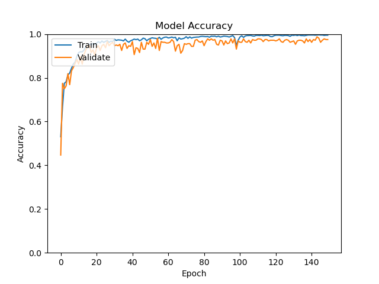
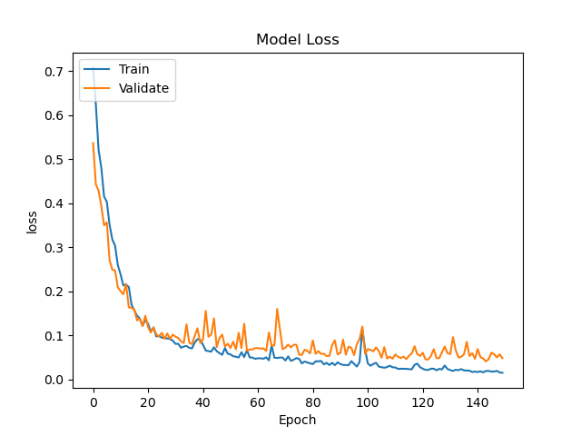
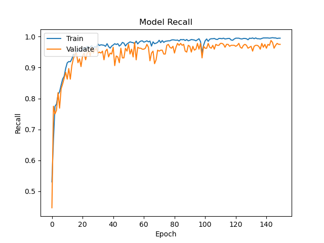
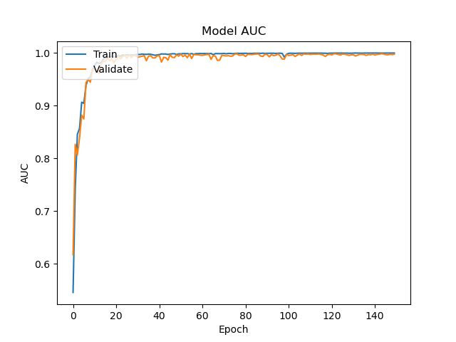

# Peter Moss Acute Myeloid & Lymphoblastic Leukemia AI Research Project
## OneAPI Acute Lymphoblastic Leukemia Classifier
### OneAPI Acute Lymphoblastic Leukemia Classifier CNN


&nbsp;

# Table Of Contents

- [Introduction](#introduction)
- [DISCLAIMER](#disclaimer)
- [ALL-IDB](#all-idb)
  - [ALL_IDB1](#all_idb1)
- [Network Architecture](#network-architecture)
- [Installation](#installation)
- [Getting Started](#getting-started)
    - [Data](#data)
    - [Configuration](#configuration)
- [Metrics](#metrics)
- [Training The Model](#training-the-model)
    - [Start The Training](#start-the-training)
        - [Data](#data)
        - [Model](#model)
        - [Training Results](#training-results)
        - [Metrics Overview](#metrics-overview)
        - [ALL-IDB Required Metrics](#all-idb-required-metrics)
- [Local Testing (CPU)](#local-testing-cpu)
    - [Local Testing Results (CPU)](#local-testing-results-cpu)
- [Local Testing (CPU/Intel Optimized Tensorflow)](#local-testing-cpuintel-optimized-tensorflow)
    - [Local Testing Results (CPU/Intel Optimized Tensorflow)](#local-testing-results-cpuintel-optimized-tensorflow)
- [Local Testing (GPU)](#local-testing-gpu)
    - [Local Testing Results (GPU)](#local-testing-results-gpu)
- [Local Testing (OpenVINO)](#local-testing-openvino)
- [Server Testing](#server-testing)
    - [Server Testing Results](#server-testing-results)
- [OpenVINO Testing](#openvino-testing)
    - [OpenVINO Testing Results](#openvino-testing-results)
- [Conclusion](#conclusion)
- [Raspberry Pi 4](#raspberry-pi-4)
- [UP2](#up2)
- [Contributing](#contributing)
  - [Contributors](#contributors)
- [Versioning](#versioning)
- [License](#license)
- [Bugs/Issues](#bugs-issues)

&nbsp;

# Introduction
The OneAPI Acute Lymphoblastic Leukemia Classifier CNN project allows you train a Convolutional Neural Network for detectimh Acute Lymphoblastic Leukemia. This model can be used in several of our Acute the Lymphoblastic Leukemia Detection Systems, including the [HIAS ALL Detection System](), the [Magic Leap 1 ALL Detection System](https://github.com/AMLResearchProject/Magic-Leap-1-ALL-Detection-System-2020), and the [Oculus Rift ALL Detection System](https://github.com/AMLResearchProject/Oculus-Rift-ALL-Detection-System-2020). The network provided in this project is based on the network proposed in the [Acute Leukemia Classification Using Convolution Neural Network In Clinical Decision Support System](https://airccj.org/CSCP/vol7/csit77505.pdf "Acute Leukemia Classification Using Convolution Neural Network In Clinical Decision Support System") paper by Thanh.TTP, Giao N. Pham, Jin-Hyeok Park, Kwang-Seok Moon, Suk-Hwan Lee, and Ki-Ryong Kwon, and the data augmentation proposed in  [Leukemia Blood Cell Image Classification Using Convolutional Neural Network](http://www.ijcte.org/vol10/1198-H0012.pdf "Leukemia Blood Cell Image Classification Using Convolutional Neural Network") by T. T. P. Thanh, Caleb Vununu, Sukhrob Atoev, Suk-Hwan Lee, and Ki-Ryong Kwon.

We have provided all of the pretrained models in the [Model](Model) directory.

&nbsp;

# DISCLAIMER
These projects should be used for research purposes only. The purpose of the projects is to show the potential of Artificial Intelligence for medical support systems such as diagnosis systems.

Although the classifiers are accurate and show good results both on paper and in real world testing, they are not meant to be an alternative to professional medical diagnosis.

Developers that have contributed to this repository have experience in using Artificial Intelligence for detecting certain types of cancer. They are not doctors, medical or cancer experts.

Please use this system responsibly.

&nbsp;

# ALL-IDB
You need to be granted access to use the Acute Lymphoblastic Leukemia Image Database for Image Processing dataset. You can find the application form and information about getting access to the dataset on [this page](https://homes.di.unimi.it/scotti/all/#download) as youll as information on how to contribute back to the project [here](https://homes.di.unimi.it/scotti/all/results.php). If you are not able to obtain a copy of the dataset please feel free to try this tutorial on your own dataset, you would be very happy to find additional AML & ALL datasets.

## ALL_IDB1
In this project, [ALL-IDB1](https://homes.di.unimi.it/scotti/all/#datasets) is used, one of the datsets from the Acute Lymphoblastic Leukemia Image Database for Image Processing dataset. You will use data augmentation to increase the amount of training and testing data you have.

"The ALL_IDB1 version 1.0 can be used both for testing segmentation capability of algorithms, as youll as the classification systems and image preprocessing methods. This dataset is composed of 108 images collected during September, 2005. It contains about 39000 blood elements, where the lymphocytes has been labeled by expert oncologists. The images are taken with different magnifications of the microscope ranging from 300 to 500."

&nbsp;

# Network Architecture


_Fig 1. Proposed architecture ([Source](https://airccj.org/CSCP/vol7/csit77505.pdf "Source"))_

In [Acute Leukemia Classification Using Convolution Neural Network In Clinical Decision Support System](https://airccj.org/CSCP/vol7/csit77505.pdf "Acute Leukemia Classification Using Convolution Neural Network In Clinical Decision Support System"), the authors propose a simple 5 layer Convolutional Neural Network.

In this project you will use an augmented dataset with the network proposed in this paper, built using Intel Optimized Tensorflow.

You will build a Convolutional Neural Network, as shown in Fig 1, consisting of the following 5 layers (missing out the zero padding layers). Note you are usng an conv sizes of (100x100x30) whereas in the paper, the authors use (50x50x30).

- Conv layer (100x100x30)
- Conv layer (100x100x30)
- Max-Pooling layer (50x50x30)
- Fully Connected layer (2 neurons)
- Softmax layer (Output 2)

&nbsp;

# Installation
Follow the [installation guide](Documentation/Installation.md) to install the requirements for this project.

&nbsp;

# Getting Started

## Data
Once you have your data you need to add it to the project filesystem. You will notice the data folder in the Model directory, **Model/Data**, inside you have **Train** & **Test**.

You will create an augmented dataset based on the [Leukemia Blood Cell Image Classification Using Convolutional Neural Network](http://www.ijcte.org/vol10/1198-H0012.pdf "Leukemia Blood Cell Image Classification Using Convolutional Neural Network") by T. T. P. Thanh, Caleb Vununu, Sukhrob Atoev, Suk-Hwan Lee, and Ki-Ryong Kwon. In this case, you will use more rotated images to increase the dataset further.

First take the ten positive and ten negative samples shown below, and place them in the **Model/Data/Test** directory. This will be used for testing the model, and also in our detection systems if you use this model with them. To ensure you get the same results, please use the same test images, these same test images are used in our detection systems. You can also try with your own images, but you may not get the same results and if you use this model with any of our detection systems you will need to make some changes when setting them up.

- im006_1.jpg
- im020_1.jpg
- im024_1.jpg
- im026_1.jpg
- im028_1.jpg
- im031_1.jpg
- im035_0.jpg
- im041_0.jpg
- im047_0.jpg
- im053_1.jpg
- im057_1.jpg
- im060_1.jpg
- im063_1.jpg
- im069_0.jpg
- im074_0.jpg
- im088_0.jpg
- im095_0.jpg
- im099_0.jpg
- im101_0.jpg
- im106_0.jpg

Next add the remaining 88 images to the **Model/Data/Train** folder. The test images used will not be augmented.

## Configuration
[config.json](Model/config.json "config.json")  holds the configuration for our network. You need to change **cnn->system=>cores** to the number of cores you have on your computer.

```
{
    "cnn": {
        "system": {
            "cores": 8,
            "server": "",
            "port": 1234
        },
        "core": [
            "Train",
            "Server",
            "Client",
            "Classify"
        ],
        "data": {
            "dim": 100,
            "file_type": ".jpg",
            "labels": [0, 1],
            "rotations": 10,
            "seed": 2,
            "split": 0.3,
            "test": "Model/Data/Test",
            "test_data": [
                "im006_1.jpg",
                "im020_1.jpg",
                "im024_1.jpg",
                "im026_1.jpg",
                "im028_1.jpg",
                "im031_1.jpg",
                "im035_0.jpg",
                "im041_0.jpg",
                "im047_0.jpg",
                "im053_1.jpg",
                "im057_1.jpg",
                "im060_1.jpg",
                "im063_1.jpg",
                "im069_0.jpg",
                "im074_0.jpg",
                "im088_0.jpg",
                "im095_0.jpg",
                "im099_0.jpg",
                "im101_0.jpg",
                "im106_0.jpg"
            ],
            "train_dir": "Model/Data/Train",
            "valid_types": [
                ".JPG",
                ".JPEG",
                ".PNG",
                ".GIF",
                ".jpg",
                ".jpeg",
                ".png",
                ".gif"
            ]
        },
        "model": {
            "saved_model_dir": "Model",
            "frozen": "frozen.pb",
            "freezing_log_dir": "Model/Freezing",
            "model": "Model/model.json",
            "weights": "Model/weights.h5"
        },
        "train": {
            "batch": 100,
            "decay_adam": 1e-6,
            "epochs": 150,
            "learning_rate_adam": 1e-4,
            "val_steps": 10
        }
    }
}
```

The cnn object contains 4 Json Objects (api, data, model and train) and a JSON Array (core). Api has the information used to set up your server you will need to add your local ip, data has the configuration related to preparing the training and validation data, model holds the model file paths, and train holds the training parameters.

In my case, the configuration above was the best out of my testing, but you may find different configurations work better. Feel free to update these settings to your liking, and please let us know of your experiences.

&nbsp;

# Metrics
We can use metrics to measure the effectiveness of our model. In this network you will use the following metrics:

```
tf.keras.metrics.BinaryAccuracy(name='accuracy'),
tf.keras.metrics.Precision(name='precision'),
tf.keras.metrics.Recall(name='recall'),
tf.keras.metrics.AUC(name='auc')
```

These metrics will be displayed and plotted once our model is trained.  A useful tutorial while working on the metrics was the [Classification on imbalanced data](https://www.tensorflow.org/tutorials/structured_data/imbalanced_data) tutorial on Tensorflow's youbsite.

&nbsp;

# Training the model
Now you are ready to train your model.

## Start The Training
Ensuring you have completed all previous steps, you can start training using the following command.

```
python ALLoneAPI.py Train
```

This tells the classifier to start in Train mode which will start the model training process.

### Data
First the data will be prepared.

```
2020-09-03 22:58:39,427 - Data - INFO - Data shape: (1584, 100, 100, 3)
2020-09-03 22:58:39,428 - Data - INFO - Labels shape: (1584, 2)
2020-09-03 22:58:39,429 - Data - INFO - Raw data: 792
2020-09-03 22:58:39,430 - Data - INFO - Raw negative data: 441
2020-09-03 22:58:39,431 - Data - INFO - Raw positive data: 792
2020-09-03 22:58:39,432 - Data - INFO - Augmented data: (1584, 100, 100, 3)
2020-09-03 22:58:39,432 - Data - INFO - Labels: (1584, 2)
2020-09-03 22:58:39,620 - Data - INFO - Training data: (1180, 100, 100, 3)
2020-09-03 22:58:39,620 - Data - INFO - Training labels: (1180, 2)
2020-09-03 22:58:39,622 - Data - INFO - Validation data: (404, 100, 100, 3)
2020-09-03 22:58:39,623 - Data - INFO - Validation labels: (404, 2)
2020-09-03 22:58:39,647 - Model - INFO - Data preperation complete.
```

### Model Summary
Our network matches the architecture proposed in the paper exactly, with exception to maybe the optimizer and loss function as this info was not provided in the paper.

Before the model begins training, you will be shown the model summary, or architecture.

```
Model: "ALLoneAPI_CNN"
_________________________________________________________________
Layer (type)                 Output Shape              Param #
=================================================================
zero_padding2d (ZeroPadding2 (None, 104, 104, 3)       0
_________________________________________________________________
conv2d (Conv2D)              (None, 100, 100, 30)      2280
_________________________________________________________________
zero_padding2d_1 (ZeroPaddin (None, 104, 104, 30)      0
_________________________________________________________________
conv2d_1 (Conv2D)            (None, 100, 100, 30)      22530
_________________________________________________________________
max_pooling2d (MaxPooling2D) (None, 50, 50, 30)        0
_________________________________________________________________
flatten (Flatten)            (None, 75000)             0
_________________________________________________________________
dense (Dense)                (None, 2)                 150002
_________________________________________________________________
activation (Activation)      (None, 2)                 0
=================================================================
Total params: 174,812
Trainable params: 174,812
Non-trainable params: 0
_________________________________________________________________
2020-09-03 07:46:38,579 - Model - INFO - Network initialization complete.
2020-09-03 07:46:38,579 - Model - INFO - Using Adam Optimizer.
Train on 1180 samples, validate on 404 samples
```

## Training Results
Below are the training results for 150 epochs. Here there is an issue with the log files being written as we are using multiple threads, there will be many errors shown in the console but you can ignore them. Hidden in the errors you will find the metrics.



_Fig 2. Accuracy_



_Fig 3. Loss_


_Fig 4. Precision_



_Fig 5. Recall_



_Fig 6. AUC_

```
2020-09-04 09:34:51,246 - Model - INFO - Metrics: loss 0.06714094072432801
2020-09-04 09:34:51,266 - Model - INFO - Metrics: acc 0.9752475
2020-09-04 09:34:51,287 - Model - INFO - Metrics: precision 0.9752475
2020-09-04 09:34:51,304 - Model - INFO - Metrics: recall 0.9752475
2020-09-04 09:34:51,326 - Model - INFO - Metrics: auc 0.9972336
2020-09-04 09:36:49,950 - Model - INFO - Confusion Matrix: [[224   4]
2020-09-04 09:36:56,044 - Model - INFO - True Positives: 170(42.07920792079208%)
2020-09-04 09:36:56,121 - Model - INFO - False Positives: 4(0.9900990099009901%)
2020-09-04 09:36:56,183 - Model - INFO - True Negatives: 224(55.445544554455445%)
2020-09-04 09:36:56,266 - Model - INFO - False Negatives: 6(1.4851485148514851%)
2020-09-04 09:36:56,325 - Model - INFO - Specificity: 0.9824561403508771
2020-09-04 09:36:56,391 - Model - INFO - Misclassification: 10(2.4752475247524752%)
```

## Metrics Overview
| Accuracy | Recall | Precision | AUC/ROC |
| ---------- | ---------- | ---------- | ---------- |
| 0.9752475 | 0.9752475 | 0.9752475 | 0.9972336 |

## ALL-IDB Required Metrics
| Figures of merit     | Amount/Value | Percentage |
| -------------------- | ----- | ---------- |
| True Positives       | 170 | 42.07920792079208% |
| False Positives      | 4 | 0.9900990099009901% |
| True Negatives       | 224 | 55.445544554455445% |
| False Negatives      | 6 | 1.4851485148514851% |
| Misclassification    | 10 | 2.4752475247524752% |
| Sensitivity / Recall | 0.9752475   | 0.98% |
| Specificity          | 0.9824561403508771  | 98% |

&nbsp;

# Local Testing (CPU)
Now you will use the test data to see how the classifier reacts to our testing data. Real world testing is the most important testing, as it allows you to see the how the model performs in a real world environment.

This part of the system will use the test data from the **Model/Data/Test** directory using your CPU. In this case, the CPU used was an Intel(R) Core(TM) i7-7820HK CPU @ 2.90GHz.

Make sure the following line in [Classes/Model.py](Classes/Model.py) is uncommented:

```
os.environ["CUDA_VISIBLE_DEVICES"]="-1"
```

To start your Tensorflow GPU environment and run the classifier on CPU, use the following commands:

```
 conda activate tf2gpu
 python ALLoneAPI.py Classify
 conda deactivate
```

## Local Testing Results (CPU)

```
C:\Users\intel-vr-1\AppData\Roaming\Python\Python37\site-packages\numpy\_distributor_init.py:32: UserWarning: loaded more than 1 DLL from .libs:
C:\Users\intel-vr-1\AppData\Roaming\Python\Python37\site-packages\numpy\.libs\libopenblas.IPBC74C7KURV7CB2PKT5Z5FNR3SIBV4J.gfortran-win_amd64.dll
C:\Users\intel-vr-1\AppData\Roaming\Python\Python37\site-packages\numpy\.libs\libopenblas.PYQHXLVVQ7VESDPUVUADXEVJOBGHJPAY.gfortran-win_amd64.dll
  stacklevel=1)
2020-09-05 01:45:05.971813: I tensorflow/stream_executor/platform/default/dso_loader.cc:48] Successfully opened dynamic library cudart64_101.dll
2020-09-05 01:45:10,829 - Core - INFO - Helpers class initialization complete.
2020-09-05 01:45:10,831 - Model - INFO - Model class initialization complete.
2020-09-05 01:45:10,832 - Core - INFO - ALLoneAPI CNN initialization complete.
2020-09-05 01:45:10.856160: I tensorflow/stream_executor/platform/default/dso_loader.cc:48] Successfully opened dynamic library nvcuda.dll
2020-09-05 01:45:10.960607: E tensorflow/stream_executor/cuda/cuda_driver.cc:314] failed call to cuInit: CUDA_ERROR_NO_DEVICE: no CUDA-capable device is detected
2020-09-05 01:45:10.966234: I tensorflow/stream_executor/cuda/cuda_diagnostics.cc:169] retrieving CUDA diagnostic information for host: GeniSysAiVr
2020-09-05 01:45:10.966512: I tensorflow/stream_executor/cuda/cuda_diagnostics.cc:176] hostname: GeniSysAiVr
2020-09-05 01:45:10.966922: I tensorflow/core/platform/cpu_feature_guard.cc:142] This TensorFlow binary is optimized with oneAPI Deep Neural Network Library (oneDNN)to use the following CPU instructions in performance-critical operations:  AVX2
To enable them in other operations, rebuild TensorFlow with the appropriate compiler flags.
2020-09-05 01:45:11.385328: I tensorflow/compiler/xla/service/service.cc:168] XLA service 0x28d63348d80 initialized for platform Host (this does not guarantee that XLA will be used). Devices:
2020-09-05 01:45:11.385477: I tensorflow/compiler/xla/service/service.cc:176]   StreamExecutor device (0): Host, Default Version
2020-09-05 01:45:11,499 - Model - INFO - Model loaded
Model: "ALLoneAPI_CNN"
_________________________________________________________________
Layer (type)                 Output Shape              Param #
=================================================================
zero_padding2d (ZeroPadding2 (None, 104, 104, 3)       0
_________________________________________________________________
conv2d (Conv2D)              (None, 100, 100, 30)      2280
_________________________________________________________________
zero_padding2d_1 (ZeroPaddin (None, 104, 104, 30)      0
_________________________________________________________________
conv2d_1 (Conv2D)            (None, 100, 100, 30)      22530
_________________________________________________________________
max_pooling2d (MaxPooling2D) (None, 50, 50, 30)        0
_________________________________________________________________
flatten (Flatten)            (None, 75000)             0
_________________________________________________________________
dense (Dense)                (None, 2)                 150002
_________________________________________________________________
activation (Activation)      (None, 2)                 0
=================================================================
Total params: 174,812
Trainable params: 174,812
Non-trainable params: 0
_________________________________________________________________
2020-09-05 01:45:11,590 - Model - INFO - Loaded test image Model/Data/Test/Im006_1.jpg
WARNING:tensorflow:From C:\Users\intel-vr-1\Desktop\Dev\AI\oneAPI-ALL-Classifier\CNN\Classes\Model.py:456: Sequential.predict_proba (from tensorflow.python.keras.engine.sequential) is deprecated and will be removed after 2021-01-01.
Instructions for updating:
Please use `model.predict()` instead.
2020-09-05 01:45:11,985 - Model - INFO - Acute Lymphoblastic Leukemia correctly detected (True Positive) in 0.4616737365722656 seconds.
2020-09-05 01:45:12,053 - Model - INFO - Loaded test image Model/Data/Test/Im020_1.jpg
2020-09-05 01:45:12,198 - Model - INFO - Acute Lymphoblastic Leukemia correctly detected (True Positive) in 0.2120676040649414 seconds.
2020-09-05 01:45:12,255 - Model - INFO - Loaded test image Model/Data/Test/Im024_1.jpg
2020-09-05 01:45:12,393 - Model - INFO - Acute Lymphoblastic Leukemia correctly detected (True Positive) in 0.19498848915100098 seconds.
2020-09-05 01:45:12,455 - Model - INFO - Loaded test image Model/Data/Test/Im026_1.jpg
2020-09-05 01:45:12,604 - Model - INFO - Acute Lymphoblastic Leukemia correctly detected (True Positive) in 0.2104320526123047 seconds.
2020-09-05 01:45:12,664 - Model - INFO - Loaded test image Model/Data/Test/Im028_1.jpg
2020-09-05 01:45:12,794 - Model - INFO - Acute Lymphoblastic Leukemia correctly detected (True Positive) in 0.18949365615844727 seconds.
2020-09-05 01:45:12,852 - Model - INFO - Loaded test image Model/Data/Test/Im031_1.jpg
2020-09-05 01:45:12,954 - Model - INFO - Acute Lymphoblastic Leukemia correctly detected (True Positive) in 0.15957283973693848 seconds.
2020-09-05 01:45:13,095 - Model - INFO - Loaded test image Model/Data/Test/Im035_0.jpg
2020-09-05 01:45:13,152 - Model - INFO - Acute Lymphoblastic Leukemia correctly not detected (True Negative) in 0.1984710693359375 seconds.
2020-09-05 01:45:13,285 - Model - INFO - Loaded test image Model/Data/Test/Im041_0.jpg
2020-09-05 01:45:13,336 - Model - INFO - Acute Lymphoblastic Leukemia correctly not detected (True Negative) in 0.1835165023803711 seconds.
2020-09-05 01:45:13,470 - Model - INFO - Loaded test image Model/Data/Test/Im047_0.jpg
2020-09-05 01:45:13,533 - Model - INFO - Acute Lymphoblastic Leukemia correctly not detected (True Negative) in 0.19747257232666016 seconds.
2020-09-05 01:45:13,678 - Model - INFO - Loaded test image Model/Data/Test/Im053_1.jpg
2020-09-05 01:45:13,748 - Model - INFO - Acute Lymphoblastic Leukemia incorrectly not detected (False Negative) in 0.21405935287475586 seconds.
2020-09-05 01:45:13,902 - Model - INFO - Loaded test image Model/Data/Test/Im057_1.jpg
2020-09-05 01:45:13,962 - Model - INFO - Acute Lymphoblastic Leukemia correctly detected (True Positive) in 0.21316766738891602 seconds.
2020-09-05 01:45:14,112 - Model - INFO - Loaded test image Model/Data/Test/Im060_1.jpg
2020-09-05 01:45:14,162 - Model - INFO - Acute Lymphoblastic Leukemia correctly detected (True Positive) in 0.19999003410339355 seconds.
2020-09-05 01:45:14,301 - Model - INFO - Loaded test image Model/Data/Test/Im063_1.jpg
2020-09-05 01:45:14,349 - Model - INFO - Acute Lymphoblastic Leukemia correctly detected (True Positive) in 0.1874842643737793 seconds.
2020-09-05 01:45:14,484 - Model - INFO - Loaded test image Model/Data/Test/Im069_0.jpg
2020-09-05 01:45:14,552 - Model - INFO - Acute Lymphoblastic Leukemia correctly not detected (True Negative) in 0.20245862007141113 seconds.
2020-09-05 01:45:14,703 - Model - INFO - Loaded test image Model/Data/Test/Im074_0.jpg
2020-09-05 01:45:14,793 - Model - INFO - Acute Lymphoblastic Leukemia correctly not detected (True Negative) in 0.24135661125183105 seconds.
2020-09-05 01:45:14,941 - Model - INFO - Loaded test image Model/Data/Test/Im088_0.jpg
2020-09-05 01:45:14,996 - Model - INFO - Acute Lymphoblastic Leukemia incorrectly detected (False Positive) in 0.20206952095031738 seconds.
2020-09-05 01:45:15,112 - Model - INFO - Loaded test image Model/Data/Test/Im095_0.jpg
2020-09-05 01:45:15,156 - Model - INFO - Acute Lymphoblastic Leukemia incorrectly detected (False Positive) in 0.15957283973693848 seconds.
2020-09-05 01:45:15,302 - Model - INFO - Loaded test image Model/Data/Test/Im099_0.jpg
2020-09-05 01:45:15,356 - Model - INFO - Acute Lymphoblastic Leukemia correctly not detected (True Negative) in 0.19947028160095215 seconds.
2020-09-05 01:45:15,551 - Model - INFO - Loaded test image Model/Data/Test/Im101_0.jpg
2020-09-05 01:45:15,622 - Model - INFO - Acute Lymphoblastic Leukemia correctly not detected (True Negative) in 0.2644679546356201 seconds.
2020-09-05 01:45:15,759 - Model - INFO - Loaded test image Model/Data/Test/Im106_0.jpg
2020-09-05 01:45:15,821 - Model - INFO - Acute Lymphoblastic Leukemia correctly not detected (True Negative) in 0.19898009300231934 seconds.
2020-09-05 01:45:15,822 - Model - INFO - Images Classifier: 20
2020-09-05 01:45:15,824 - Model - INFO - True Positives: 9
2020-09-05 01:45:15,826 - Model - INFO - False Positives: 2
2020-09-05 01:45:15,826 - Model - INFO - True Negatives: 8
2020-09-05 01:45:15,827 - Model - INFO - False Negatives: 1
2020-09-05 01:45:15,827 - Model - INFO - Total Time Taken: 4.290765762329102
```

# Local Testing (CPU/Intel Optimized Tensorflow)
Now you will use the test data to see how the classifier reacts to our testing data. Real world testing is the most important testing, as it allows you to see the how the model performs in a real world environment.

This part of the system will use the test data from the **Model/Data/Test** directory using your CPU and Intel Optimized Tensorflow. In this case, the CPU used was an Intel(R) Core(TM) i7-7820HK CPU @ 2.90GHz.

To start your Tensorflow MKL environment and run the classifier on CPU with Intel Optimized Tensorflow, use the following commands:

```
 conda activate tf2mkl
 python ALLoneAPI.py Classify
 conda deactivate
```

## Local Testing Results (CPU/Intel Optimized Tensorflow)

```
Intel(R) Data Analytics Acceleration Library (Intel(R) DAAL) solvers for sklearn enabled: https://intelpython.github.io/daal4py/sklearn.html
2020-09-05 01:47:03,681 - Core - INFO - Helpers class initialization complete.
2020-09-05 01:47:03,683 - Model - INFO - Model class initialization complete.
2020-09-05 01:47:03,683 - Core - INFO - ALLoneAPI CNN initialization complete.
2020-09-05 01:47:03.717003: I tensorflow/core/platform/cpu_feature_guard.cc:142] Your CPU supports instructions that this TensorFlow binary was not compiled to use: AVX2
2020-09-05 01:47:03,935 - Model - INFO - Model loaded
Model: "AllDS2020_TF_CNN"
_________________________________________________________________
Layer (type)                 Output Shape              Param #
=================================================================
zero_padding2d (ZeroPadding2 (None, 104, 104, 3)       0
_________________________________________________________________
conv2d (Conv2D)              (None, 100, 100, 30)      2280
_________________________________________________________________
zero_padding2d_1 (ZeroPaddin (None, 104, 104, 30)      0
_________________________________________________________________
conv2d_1 (Conv2D)            (None, 100, 100, 30)      22530
_________________________________________________________________
max_pooling2d (MaxPooling2D) (None, 50, 50, 30)        0
_________________________________________________________________
flatten (Flatten)            (None, 75000)             0
_________________________________________________________________
dense (Dense)                (None, 2)                 150002
_________________________________________________________________
activation (Activation)      (None, 2)                 0
=================================================================
Total params: 174,812
Trainable params: 174,812
Non-trainable params: 0
_________________________________________________________________
2020-09-05 01:47:04,015 - Model - INFO - Loaded test image Model/Data/Test/Im006_1.jpg
2020-09-05 01:47:04,098 - Model - INFO - Acute Lymphoblastic Leukemia correctly detected (True Positive) in 0.14226913452148438 seconds.
2020-09-05 01:47:04,154 - Model - INFO - Loaded test image Model/Data/Test/Im020_1.jpg
2020-09-05 01:47:04,167 - Model - INFO - Acute Lymphoblastic Leukemia correctly detected (True Positive) in 0.06781816482543945 seconds.
2020-09-05 01:47:04,220 - Model - INFO - Loaded test image Model/Data/Test/Im024_1.jpg
2020-09-05 01:47:04,238 - Model - INFO - Acute Lymphoblastic Leukemia correctly detected (True Positive) in 0.06978487968444824 seconds.
2020-09-05 01:47:04,299 - Model - INFO - Loaded test image Model/Data/Test/Im026_1.jpg
2020-09-05 01:47:04,316 - Model - INFO - Acute Lymphoblastic Leukemia correctly detected (True Positive) in 0.07782340049743652 seconds.
2020-09-05 01:47:04,369 - Model - INFO - Loaded test image Model/Data/Test/Im028_1.jpg
2020-09-05 01:47:04,383 - Model - INFO - Acute Lymphoblastic Leukemia correctly detected (True Positive) in 0.06778931617736816 seconds.
2020-09-05 01:47:04,443 - Model - INFO - Loaded test image Model/Data/Test/Im031_1.jpg
2020-09-05 01:47:04,460 - Model - INFO - Acute Lymphoblastic Leukemia correctly detected (True Positive) in 0.07534003257751465 seconds.
2020-09-05 01:47:04,622 - Model - INFO - Loaded test image Model/Data/Test/Im035_0.jpg
2020-09-05 01:47:04,641 - Model - INFO - Acute Lymphoblastic Leukemia correctly not detected (True Negative) in 0.18003439903259277 seconds.
2020-09-05 01:47:04,796 - Model - INFO - Loaded test image Model/Data/Test/Im041_0.jpg
2020-09-05 01:47:04,814 - Model - INFO - Acute Lymphoblastic Leukemia correctly not detected (True Negative) in 0.17348909378051758 seconds.
2020-09-05 01:47:04,958 - Model - INFO - Loaded test image Model/Data/Test/Im047_0.jpg
2020-09-05 01:47:04,978 - Model - INFO - Acute Lymphoblastic Leukemia correctly not detected (True Negative) in 0.1635303497314453 seconds.
2020-09-05 01:47:05,118 - Model - INFO - Loaded test image Model/Data/Test/Im053_1.jpg
2020-09-05 01:47:05,136 - Model - INFO - Acute Lymphoblastic Leukemia incorrectly not detected (False Negative) in 0.1575782299041748 seconds.
2020-09-05 01:47:05,262 - Model - INFO - Loaded test image Model/Data/Test/Im057_1.jpg
2020-09-05 01:47:05,279 - Model - INFO - Acute Lymphoblastic Leukemia correctly detected (True Positive) in 0.14162373542785645 seconds.
2020-09-05 01:47:05,408 - Model - INFO - Loaded test image Model/Data/Test/Im060_1.jpg
2020-09-05 01:47:05,424 - Model - INFO - Acute Lymphoblastic Leukemia correctly detected (True Positive) in 0.14461278915405273 seconds.
2020-09-05 01:47:05,575 - Model - INFO - Loaded test image Model/Data/Test/Im063_1.jpg
2020-09-05 01:47:05,592 - Model - INFO - Acute Lymphoblastic Leukemia correctly detected (True Positive) in 0.16752171516418457 seconds.
2020-09-05 01:47:05,744 - Model - INFO - Loaded test image Model/Data/Test/Im069_0.jpg
2020-09-05 01:47:05,765 - Model - INFO - Acute Lymphoblastic Leukemia correctly not detected (True Negative) in 0.17204809188842773 seconds.
2020-09-05 01:47:05,896 - Model - INFO - Loaded test image Model/Data/Test/Im074_0.jpg
2020-09-05 01:47:05,913 - Model - INFO - Acute Lymphoblastic Leukemia correctly not detected (True Negative) in 0.1470644474029541 seconds.
2020-09-05 01:47:06,090 - Model - INFO - Loaded test image Model/Data/Test/Im088_0.jpg
2020-09-05 01:47:06,113 - Model - INFO - Acute Lymphoblastic Leukemia incorrectly detected (False Positive) in 0.1994304656982422 seconds.
2020-09-05 01:47:06,234 - Model - INFO - Loaded test image Model/Data/Test/Im095_0.jpg
2020-09-05 01:47:06,252 - Model - INFO - Acute Lymphoblastic Leukemia incorrectly detected (False Positive) in 0.13962817192077637 seconds.
2020-09-05 01:47:06,383 - Model - INFO - Loaded test image Model/Data/Test/Im099_0.jpg
2020-09-05 01:47:06,399 - Model - INFO - Acute Lymphoblastic Leukemia correctly not detected (True Negative) in 0.14561891555786133 seconds.
2020-09-05 01:47:06,525 - Model - INFO - Loaded test image Model/Data/Test/Im101_0.jpg
2020-09-05 01:47:06,543 - Model - INFO - Acute Lymphoblastic Leukemia correctly not detected (True Negative) in 0.14262723922729492 seconds.
2020-09-05 01:47:06,684 - Model - INFO - Loaded test image Model/Data/Test/Im106_0.jpg
2020-09-05 01:47:06,702 - Model - INFO - Acute Lymphoblastic Leukemia correctly not detected (True Negative) in 0.15857458114624023 seconds.
2020-09-05 01:47:06,703 - Model - INFO - Images Classifier: 20
2020-09-05 01:47:06,703 - Model - INFO - True Positives: 9
2020-09-05 01:47:06,704 - Model - INFO - False Positives: 2
2020-09-05 01:47:06,705 - Model - INFO - True Negatives: 8
2020-09-05 01:47:06,705 - Model - INFO - False Negatives: 1
2020-09-05 01:47:06,706 - Model - INFO - Total Time Taken: 2.7342071533203125
```

# Local Testing (GPU)
This part of the system will use the test data from the **Model/Data/Test** directory using GPU, in this case, GeForce GTX 1080.

Make sure the following line in [Classes/Model.py](Classes/Model.py) is commented:

```
#os.environ["CUDA_VISIBLE_DEVICES"]="-1"
```

To start your Tensorflow GPU environment and run the classifier on GPU, use the following commands:

```
 conda activate tf2gpu
 python ALLoneAPI.py Classify
 conda deactivate
```

## Local Testing Results (GPU)

```
C:\Users\intel-vr-1\AppData\Roaming\Python\Python37\site-packages\numpy\_distributor_init.py:32: UserWarning: loaded more than 1 DLL from .libs:
C:\Users\intel-vr-1\AppData\Roaming\Python\Python37\site-packages\numpy\.libs\libopenblas.IPBC74C7KURV7CB2PKT5Z5FNR3SIBV4J.gfortran-win_amd64.dll
C:\Users\intel-vr-1\AppData\Roaming\Python\Python37\site-packages\numpy\.libs\libopenblas.PYQHXLVVQ7VESDPUVUADXEVJOBGHJPAY.gfortran-win_amd64.dll
  stacklevel=1)
2020-09-05 01:43:47.559225: I tensorflow/stream_executor/platform/default/dso_loader.cc:48] Successfully opened dynamic library cudart64_101.dll
2020-09-05 01:43:52,715 - Core - INFO - Helpers class initialization complete.
2020-09-05 01:43:52,718 - Model - INFO - Model class initialization complete.
2020-09-05 01:43:52,719 - Core - INFO - ALLoneAPI CNN initialization complete.
2020-09-05 01:43:52.760817: I tensorflow/stream_executor/platform/default/dso_loader.cc:48] Successfully opened dynamic library nvcuda.dll
2020-09-05 01:43:52.905609: I tensorflow/core/common_runtime/gpu/gpu_device.cc:1716] Found device 0 with properties:
pciBusID: 0000:01:00.0 name: GeForce GTX 1080 computeCapability: 6.1
coreClock: 1.771GHz coreCount: 20 deviceMemorySize: 8.00GiB deviceMemoryBandwidth: 298.32GiB/s
2020-09-05 01:43:52.905856: I tensorflow/stream_executor/platform/default/dso_loader.cc:48] Successfully opened dynamic library cudart64_101.dll
2020-09-05 01:43:52.952381: I tensorflow/stream_executor/platform/default/dso_loader.cc:48] Successfully opened dynamic library cublas64_10.dll
2020-09-05 01:43:52.976091: I tensorflow/stream_executor/platform/default/dso_loader.cc:48] Successfully opened dynamic library cufft64_10.dll
2020-09-05 01:43:52.994238: I tensorflow/stream_executor/platform/default/dso_loader.cc:48] Successfully opened dynamic library curand64_10.dll
2020-09-05 01:43:53.023952: I tensorflow/stream_executor/platform/default/dso_loader.cc:48] Successfully opened dynamic library cusolver64_10.dll
2020-09-05 01:43:53.050571: I tensorflow/stream_executor/platform/default/dso_loader.cc:48] Successfully opened dynamic library cusparse64_10.dll
2020-09-05 01:43:53.098573: I tensorflow/stream_executor/platform/default/dso_loader.cc:48] Successfully opened dynamic library cudnn64_7.dll
2020-09-05 01:43:53.098850: I tensorflow/core/common_runtime/gpu/gpu_device.cc:1858] Adding visible gpu devices: 0
2020-09-05 01:43:53.101109: I tensorflow/core/platform/cpu_feature_guard.cc:142] This TensorFlow binary is optimized with oneAPI Deep Neural Network Library (oneDNN)to use the following CPU instructions in performance-critical operations:  AVX2
To enable them in other operations, rebuild TensorFlow with the appropriate compiler flags.
2020-09-05 01:43:53.583546: I tensorflow/compiler/xla/service/service.cc:168] XLA service 0x2220c079980 initialized for platform Host (this does not guarantee that XLA will be used). Devices:
2020-09-05 01:43:53.583724: I tensorflow/compiler/xla/service/service.cc:176]   StreamExecutor device (0): Host, Default Version
2020-09-05 01:43:53.606973: I tensorflow/core/common_runtime/gpu/gpu_device.cc:1716] Found device 0 with properties:
pciBusID: 0000:01:00.0 name: GeForce GTX 1080 computeCapability: 6.1
coreClock: 1.771GHz coreCount: 20 deviceMemorySize: 8.00GiB deviceMemoryBandwidth: 298.32GiB/s
2020-09-05 01:43:53.607246: I tensorflow/stream_executor/platform/default/dso_loader.cc:48] Successfully opened dynamic library cudart64_101.dll
2020-09-05 01:43:53.607975: I tensorflow/stream_executor/platform/default/dso_loader.cc:48] Successfully opened dynamic library cublas64_10.dll
2020-09-05 01:43:53.608569: I tensorflow/stream_executor/platform/default/dso_loader.cc:48] Successfully opened dynamic library cufft64_10.dll
2020-09-05 01:43:53.609176: I tensorflow/stream_executor/platform/default/dso_loader.cc:48] Successfully opened dynamic library curand64_10.dll
2020-09-05 01:43:53.609825: I tensorflow/stream_executor/platform/default/dso_loader.cc:48] Successfully opened dynamic library cusolver64_10.dll
2020-09-05 01:43:53.610584: I tensorflow/stream_executor/platform/default/dso_loader.cc:48] Successfully opened dynamic library cusparse64_10.dll
2020-09-05 01:43:53.611271: I tensorflow/stream_executor/platform/default/dso_loader.cc:48] Successfully opened dynamic library cudnn64_7.dll
2020-09-05 01:43:53.612050: I tensorflow/core/common_runtime/gpu/gpu_device.cc:1858] Adding visible gpu devices: 0
2020-09-05 01:43:54.600926: I tensorflow/core/common_runtime/gpu/gpu_device.cc:1257] Device interconnect StreamExecutor with strength 1 edge matrix:
2020-09-05 01:43:54.601105: I tensorflow/core/common_runtime/gpu/gpu_device.cc:1263]      0
2020-09-05 01:43:54.602319: I tensorflow/core/common_runtime/gpu/gpu_device.cc:1276] 0:   N
2020-09-05 01:43:54.603501: I tensorflow/core/common_runtime/gpu/gpu_device.cc:1402] Created TensorFlow device (/job:localhost/replica:0/task:0/device:GPU:0 with 6692 MB memory) -> physical GPU (device: 0, name: GeForce GTX 1080, pci bus id: 0000:01:00.0, compute capability: 6.1)
2020-09-05 01:43:54.692927: I tensorflow/compiler/xla/service/service.cc:168] XLA service 0x222367d0f40 initialized for platform CUDA (this does not guarantee that XLA will be used). Devices:
2020-09-05 01:43:54.693069: I tensorflow/compiler/xla/service/service.cc:176]   StreamExecutor device (0): GeForce GTX 1080, Compute Capability 6.1
2020-09-05 01:43:55,392 - Model - INFO - Model loaded
Model: "ALLoneAPI_CNN"
_________________________________________________________________
Layer (type)                 Output Shape              Param #
=================================================================
zero_padding2d (ZeroPadding2 (None, 104, 104, 3)       0
_________________________________________________________________
conv2d (Conv2D)              (None, 100, 100, 30)      2280
_________________________________________________________________
zero_padding2d_1 (ZeroPaddin (None, 104, 104, 30)      0
_________________________________________________________________
conv2d_1 (Conv2D)            (None, 100, 100, 30)      22530
_________________________________________________________________
max_pooling2d (MaxPooling2D) (None, 50, 50, 30)        0
_________________________________________________________________
flatten (Flatten)            (None, 75000)             0
_________________________________________________________________
dense (Dense)                (None, 2)                 150002
_________________________________________________________________
activation (Activation)      (None, 2)                 0
=================================================================
Total params: 174,812
Trainable params: 174,812
Non-trainable params: 0
_________________________________________________________________
2020-09-05 01:43:55,480 - Model - INFO - Loaded test image Model/Data/Test/Im006_1.jpg
WARNING:tensorflow:From C:\Users\intel-vr-1\Desktop\Dev\AI\oneAPI-ALL-Classifier\CNN\Classes\Model.py:456: Sequential.predict_proba (from tensorflow.python.keras.engine.sequential) is deprecated and will be removed after 2021-01-01.
Instructions for updating:
Please use `model.predict()` instead.
2020-09-05 01:43:55.809979: I tensorflow/stream_executor/platform/default/dso_loader.cc:48] Successfully opened dynamic library cublas64_10.dll
2020-09-05 01:43:56.199379: I tensorflow/stream_executor/platform/default/dso_loader.cc:48] Successfully opened dynamic library cudnn64_7.dll
2020-09-05 01:43:57.222017: W tensorflow/stream_executor/gpu/redzone_allocator.cc:314] Internal: Invoking GPU asm compilation is supported on Cuda non-Windows platforms only
Relying on driver to perform ptx compilation.
Modify $PATH to customize ptxas location.
This message will be only logged once.
2020-09-05 01:43:57,388 - Model - INFO - Acute Lymphoblastic Leukemia correctly detected (True Positive) in 1.9757919311523438 seconds.
2020-09-05 01:43:57,453 - Model - INFO - Loaded test image Model/Data/Test/Im020_1.jpg
2020-09-05 01:43:57,556 - Model - INFO - Acute Lymphoblastic Leukemia correctly detected (True Positive) in 0.16655302047729492 seconds.
2020-09-05 01:43:57,625 - Model - INFO - Loaded test image Model/Data/Test/Im024_1.jpg
2020-09-05 01:43:57,753 - Model - INFO - Acute Lymphoblastic Leukemia correctly detected (True Positive) in 0.19747233390808105 seconds.
2020-09-05 01:43:57,807 - Model - INFO - Loaded test image Model/Data/Test/Im026_1.jpg
2020-09-05 01:43:57,917 - Model - INFO - Acute Lymphoblastic Leukemia correctly detected (True Positive) in 0.16356253623962402 seconds.
2020-09-05 01:43:57,981 - Model - INFO - Loaded test image Model/Data/Test/Im028_1.jpg
2020-09-05 01:43:58,105 - Model - INFO - Acute Lymphoblastic Leukemia correctly detected (True Positive) in 0.18849658966064453 seconds.
2020-09-05 01:43:58,171 - Model - INFO - Loaded test image Model/Data/Test/Im031_1.jpg
2020-09-05 01:43:58,294 - Model - INFO - Acute Lymphoblastic Leukemia correctly detected (True Positive) in 0.1874983310699463 seconds.
2020-09-05 01:43:58,431 - Model - INFO - Loaded test image Model/Data/Test/Im035_0.jpg
2020-09-05 01:43:58,550 - Model - INFO - Acute Lymphoblastic Leukemia correctly not detected (True Negative) in 0.255307674407959 seconds.
2020-09-05 01:43:58,678 - Model - INFO - Loaded test image Model/Data/Test/Im041_0.jpg
2020-09-05 01:43:58,807 - Model - INFO - Acute Lymphoblastic Leukemia correctly not detected (True Negative) in 0.2563152313232422 seconds.
2020-09-05 01:43:58,955 - Model - INFO - Loaded test image Model/Data/Test/Im047_0.jpg
2020-09-05 01:43:59,071 - Model - INFO - Acute Lymphoblastic Leukemia correctly not detected (True Negative) in 0.2642934322357178 seconds.
2020-09-05 01:43:59,185 - Model - INFO - Loaded test image Model/Data/Test/Im053_1.jpg
2020-09-05 01:43:59,296 - Model - INFO - Acute Lymphoblastic Leukemia incorrectly not detected (False Negative) in 0.22509431838989258 seconds.
2020-09-05 01:43:59,413 - Model - INFO - Loaded test image Model/Data/Test/Im057_1.jpg
2020-09-05 01:43:59,546 - Model - INFO - Acute Lymphoblastic Leukemia correctly detected (True Positive) in 0.2503962516784668 seconds.
2020-09-05 01:43:59,666 - Model - INFO - Loaded test image Model/Data/Test/Im060_1.jpg
2020-09-05 01:43:59,783 - Model - INFO - Acute Lymphoblastic Leukemia correctly detected (True Positive) in 0.23506760597229004 seconds.
2020-09-05 01:43:59,911 - Model - INFO - Loaded test image Model/Data/Test/Im063_1.jpg
2020-09-05 01:44:00,030 - Model - INFO - Acute Lymphoblastic Leukemia correctly detected (True Positive) in 0.24635100364685059 seconds.
2020-09-05 01:44:00,163 - Model - INFO - Loaded test image Model/Data/Test/Im069_0.jpg
2020-09-05 01:44:00,310 - Model - INFO - Acute Lymphoblastic Leukemia correctly not detected (True Negative) in 0.2791135311126709 seconds.
2020-09-05 01:44:00,436 - Model - INFO - Loaded test image Model/Data/Test/Im074_0.jpg
2020-09-05 01:44:00,574 - Model - INFO - Acute Lymphoblastic Leukemia correctly not detected (True Negative) in 0.263805627822876 seconds.
2020-09-05 01:44:00,705 - Model - INFO - Loaded test image Model/Data/Test/Im088_0.jpg
2020-09-05 01:44:00,821 - Model - INFO - Acute Lymphoblastic Leukemia incorrectly detected (False Positive) in 0.24634122848510742 seconds.
2020-09-05 01:44:00,935 - Model - INFO - Loaded test image Model/Data/Test/Im095_0.jpg
2020-09-05 01:44:01,042 - Model - INFO - Acute Lymphoblastic Leukemia incorrectly detected (False Positive) in 0.22075915336608887 seconds.
2020-09-05 01:44:01,162 - Model - INFO - Loaded test image Model/Data/Test/Im099_0.jpg
2020-09-05 01:44:01,252 - Model - INFO - Acute Lymphoblastic Leukemia correctly not detected (True Negative) in 0.21043729782104492 seconds.
2020-09-05 01:44:01,371 - Model - INFO - Loaded test image Model/Data/Test/Im101_0.jpg
2020-09-05 01:44:01,416 - Model - INFO - Acute Lymphoblastic Leukemia correctly not detected (True Negative) in 0.16413259506225586 seconds.
2020-09-05 01:44:01,531 - Model - INFO - Loaded test image Model/Data/Test/Im106_0.jpg
2020-09-05 01:44:01,588 - Model - INFO - Acute Lymphoblastic Leukemia correctly not detected (True Negative) in 0.17154455184936523 seconds.
2020-09-05 01:44:01,589 - Model - INFO - Images Classifier: 20
2020-09-05 01:44:01,591 - Model - INFO - True Positives: 9
2020-09-05 01:44:01,593 - Model - INFO - False Positives: 2
2020-09-05 01:44:01,593 - Model - INFO - True Negatives: 8
2020-09-05 01:44:01,594 - Model - INFO - False Negatives: 1
2020-09-05 01:44:01,595 - Model - INFO - Total Time Taken: 6.168334245681763
```

# Local Testing (OpenVINO)
At the end of the training the program will freeze the Tensorflow model ready for converting to an Intermediate Representation so that the model can be used with OpenVINO.

In the [Model](Model) directory, you will find the model files and a directory called **Freezing**. Inside this directory is the frozen model that you will convert. After the installation of OpenVINO on Windows and setting the environment variables, I was unable to run the [ALLOpenVINO.py](ALLOpenVINO.py) script which failed with the following error:

```
Traceback (most recent call last):
  File "OpenVINO.py", line 18, in <module>
    from openvino import inference_engine as ie
  File "C:\Program Files (x86)\IntelSWTools\openvino\python\python3.6\openvino\inference_engine\__init__.py", line 1, in <module>
    from .ie_api import *
ImportError: DLL load failed: The specified module could not be found.
```
To use this model with OpenVINO on UP2, continue to the [Acute Lymphoblastic Leukemia oneAPI UP2 Classifier](../UP2) project. To use this model with OpenVINO on RPI4, continue to the [Acute Lymphoblastic Leukemia oneAPI UP2 Classifier](../RPI4) project.

&nbsp;

# Server Testing
Now you will use the test data to see how the server classifier reacts.

This part of the system will use the test data from the **Model/Data/Test** directory.

You need to open two terminal windows or tabs, in the first, use the following command to start the server:

```
python ALLoneAPI.py Server
```
You should see the following:
```
Intel(R) Data Analytics Acceleration Library (Intel(R) DAAL) solvers for sklearn enabled: https://intelpython.github.io/daal4py/sklearn.html
2020-09-04 09:46:52,669 - Core - INFO - Helpers class initialization complete.
2020-09-04 09:46:52,671 - Model - INFO - Model class initialization complete.
2020-09-04 09:46:52,672 - Core - INFO - ALLoneAPI CNN initialization complete.
2020-09-04 09:46:52.707819: I tensorflow/core/platform/cpu_feature_guard.cc:142] Your CPU supports instructions that this TensorFlow binary was not compiled to use: AVX2
2020-09-04 09:46:52,915 - Model - INFO - Model loaded
Model: "ALLoneAPI_CNN"
_________________________________________________________________
Layer (type)                 Output Shape              Param #
=================================================================
zero_padding2d (ZeroPadding2 (None, 104, 104, 3)       0
_________________________________________________________________
conv2d (Conv2D)              (None, 100, 100, 30)      2280
_________________________________________________________________
zero_padding2d_1 (ZeroPaddin (None, 104, 104, 30)      0
_________________________________________________________________
conv2d_1 (Conv2D)            (None, 100, 100, 30)      22530
_________________________________________________________________
max_pooling2d (MaxPooling2D) (None, 50, 50, 30)        0
_________________________________________________________________
flatten (Flatten)            (None, 75000)             0
_________________________________________________________________
dense (Dense)                (None, 2)                 150002
_________________________________________________________________
activation (Activation)      (None, 2)                 0
=================================================================
Total params: 174,812
Trainable params: 174,812
Non-trainable params: 0
_________________________________________________________________
 * Serving Flask app "Classes.Server" (lazy loading)
 * Environment: production
   WARNING: This is a development server. Do not use it in a production deployment.
   Use a production WSGI server instead.
 * Debug mode: off
 * Running on http://192.168.1.33:1234/ (Press CTRL+C to quit)
```

In your second terminal, use the following command:

```
python ALLoneAPI.py Client
```

## Server Testing Results

```
python ALLoneAPI.py Client
Intel(R) Data Analytics Acceleration Library (Intel(R) DAAL) solvers for sklearn enabled: https://intelpython.github.io/daal4py/sklearn.html
2020-09-04 10:16:49,810 - Core - INFO - Helpers class initialization complete.
2020-09-04 10:16:49,812 - Model - INFO - Model class initialization complete.
2020-09-04 10:16:49,812 - Core - INFO - ALLoneAPI CNN initialization complete.
2020-09-04 10:16:49,814 - Model - INFO - Sending request for: Model/Data/Test/Im006_1.jpg
2020-09-04 10:17:01,939 - Model - INFO - Acute Lymphoblastic Leukemia correctly detected (True Positive)

2020-09-04 10:17:08,942 - Model - INFO - Sending request for: Model/Data/Test/Im020_1.jpg
2020-09-04 10:17:09,209 - Model - INFO - Acute Lymphoblastic Leukemia correctly detected (True Positive)

2020-09-04 10:17:16,210 - Model - INFO - Sending request for: Model/Data/Test/Im024_1.jpg
2020-09-04 10:17:16,452 - Model - INFO - Acute Lymphoblastic Leukemia correctly detected (True Positive)

2020-09-04 10:17:23,454 - Model - INFO - Sending request for: Model/Data/Test/Im026_1.jpg
2020-09-04 10:17:23,698 - Model - INFO - Acute Lymphoblastic Leukemia correctly detected (True Positive)

2020-09-04 10:17:30,700 - Model - INFO - Sending request for: Model/Data/Test/Im028_1.jpg
2020-09-04 10:17:30,952 - Model - INFO - Acute Lymphoblastic Leukemia correctly detected (True Positive)

2020-09-04 10:17:37,953 - Model - INFO - Sending request for: Model/Data/Test/Im031_1.jpg
2020-09-04 10:17:38,213 - Model - INFO - Acute Lymphoblastic Leukemia correctly detected (True Positive)

2020-09-04 10:17:45,215 - Model - INFO - Sending request for: Model/Data/Test/Im035_0.jpg
2020-09-04 10:17:45,787 - Model - INFO - Acute Lymphoblastic Leukemia correctly not detected (True Negative)

2020-09-04 10:17:52,789 - Model - INFO - Sending request for: Model/Data/Test/Im041_0.jpg
2020-09-04 10:17:53,349 - Model - INFO - Acute Lymphoblastic Leukemia correctly not detected (True Negative)

2020-09-04 10:18:00,350 - Model - INFO - Sending request for: Model/Data/Test/Im047_0.jpg
2020-09-04 10:18:00,891 - Model - INFO - Acute Lymphoblastic Leukemia correctly not detected (True Negative)

2020-09-04 10:18:07,893 - Model - INFO - Sending request for: Model/Data/Test/Im053_1.jpg
2020-09-04 10:18:08,780 - Model - INFO - Acute Lymphoblastic Leukemia incorrectly not detected (False Negative)

2020-09-04 10:18:15,782 - Model - INFO - Sending request for: Model/Data/Test/Im057_1.jpg
2020-09-04 10:18:16,354 - Model - INFO - Acute Lymphoblastic Leukemia correctly detected (True Positive)

2020-09-04 10:18:23,356 - Model - INFO - Sending request for: Model/Data/Test/Im060_1.jpg
2020-09-04 10:18:23,916 - Model - INFO - Acute Lymphoblastic Leukemia correctly detected (True Positive)

2020-09-04 10:18:30,919 - Model - INFO - Sending request for: Model/Data/Test/Im063_1.jpg
2020-09-04 10:18:31,462 - Model - INFO - Acute Lymphoblastic Leukemia correctly detected (True Positive)

2020-09-04 10:18:38,464 - Model - INFO - Sending request for: Model/Data/Test/Im069_0.jpg
2020-09-04 10:18:38,998 - Model - INFO - Acute Lymphoblastic Leukemia correctly not detected (True Negative)

2020-09-04 10:18:46,001 - Model - INFO - Sending request for: Model/Data/Test/Im074_0.jpg
2020-09-04 10:18:46,555 - Model - INFO - Acute Lymphoblastic Leukemia correctly not detected (True Negative)

2020-09-04 10:18:53,557 - Model - INFO - Sending request for: Model/Data/Test/Im088_0.jpg
2020-09-04 10:18:54,187 - Model - INFO - Acute Lymphoblastic Leukemia incorrectly detected (False Positive)

2020-09-04 10:19:01,189 - Model - INFO - Sending request for: Model/Data/Test/Im095_0.jpg
2020-09-04 10:19:01,817 - Model - INFO - Acute Lymphoblastic Leukemia incorrectly detected (False Positive)

2020-09-04 10:19:08,821 - Model - INFO - Sending request for: Model/Data/Test/Im099_0.jpg
2020-09-04 10:19:09,411 - Model - INFO - Acute Lymphoblastic Leukemia correctly not detected (True Negative)

2020-09-04 10:19:16,414 - Model - INFO - Sending request for: Model/Data/Test/Im101_0.jpg
2020-09-04 10:19:16,978 - Model - INFO - Acute Lymphoblastic Leukemia correctly not detected (True Negative)

2020-09-04 10:19:23,980 - Model - INFO - Sending request for: Model/Data/Test/Im106_0.jpg
2020-09-04 10:19:24,527 - Model - INFO - Acute Lymphoblastic Leukemia correctly not detected (True Negative)

2020-09-04 10:19:31,529 - Model - INFO - Images Classifier: 20
2020-09-04 10:19:31,529 - Model - INFO - True Positives: 9
2020-09-04 10:19:31,530 - Model - INFO - False Positives: 2
2020-09-04 10:19:31,531 - Model - INFO - True Negatives: 8
2020-09-04 10:19:31,531 - Model - INFO - False Negatives: 1
```

&nbsp;

# Conclusion
Below is an overview of the benchmarks you carried out in this project.

| Processing | Images | Time (seconds) |
| -------------------- | -------------------- | -------------------- |
| CPU | 20 | 4.290765762329102 |
| CPU/Intel Optimized Tensorflow | 20 | 2.7342071533203125 |
| GPU | 20 | 6.168334245681763 |
| OpenVINO | 20 | NA |

&nbsp;

# Raspberry Pi 4
Now that your model is trained and tested, head over to the [RPI 4](../RPI4 "RPI 4") project to setup your model on the Raspberry Pi 4 ready to be used with the [HIAS ALL Detection System](https://github.com/LeukemiaAiResearch/HIAS "HIAS ALL Detection System") or our other detection systems.

&nbsp;

# UP2
If you want to use an UP2 head to the [UP2](../UP2 "UP2") project to setup your model on the UP2 ready to be used with the [HIAS ALL Detection System](https://github.com/LeukemiaAiResearch/HIAS "HIAS ALL Detection System") or our other detection systems.

&nbsp;

# Contributing
The Peter Moss Acute Myeloid & Lymphoblastic Leukemia AI Research project encourages and youlcomes code contributions, bug fixes and enhancements from the Github.

Please read the [CONTRIBUTING](../CONTRIBUTING.md "CONTRIBUTING") document for a full guide to forking our repositories and submitting your pull requests. You will also find information about our code of conduct on this page.

## Contributors
- [Adam Milton-Barker](https://www.leukemiaresearchassociation.ai/team/adam-milton-barker "Adam Milton-Barker") - [Asociacion De Investigacion En Inteligencia Artificial Para La Leucemia Peter Moss](https://www.leukemiaresearchassociation.ai "Asociacion De Investigacion En Inteligencia Artificial Para La Leucemia Peter Moss") President/Lead Developer, Sabadell, Spain

&nbsp;

# Versioning
You use SemVer for versioning. For the versions available, see [Releases](../releases "Releases").

&nbsp;

# License
This project is licensed under the **MIT License** - see the [LICENSE](../LICENSE.md "LICENSE") file for details.

&nbsp;

# Bugs/Issues
You use the [repo issues](../issues "repo issues") to track bugs and general requests related to using this project. See [CONTRIBUTING](../CONTRIBUTING.md "CONTRIBUTING") for more info on how to submit bugs, feature requests and proposals.