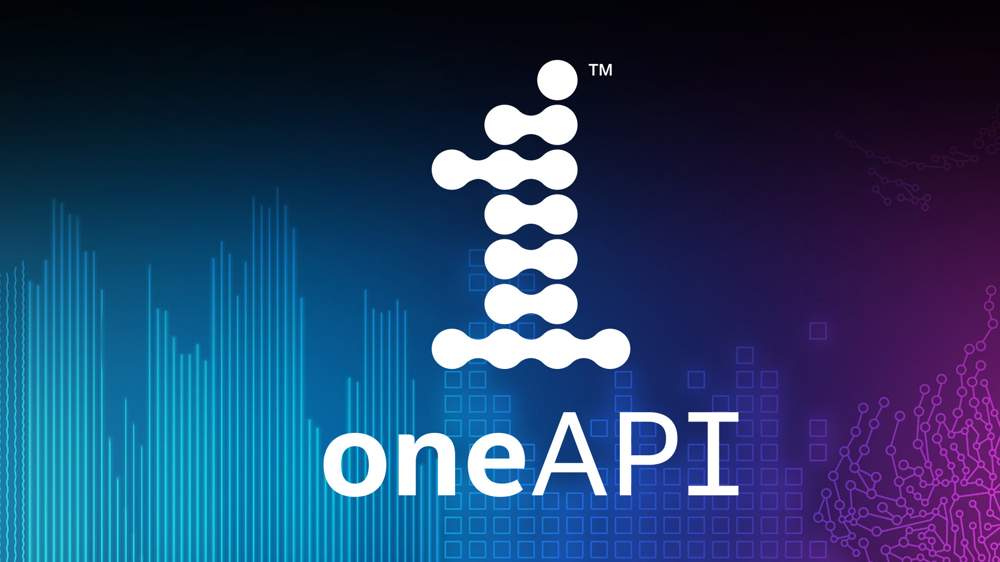
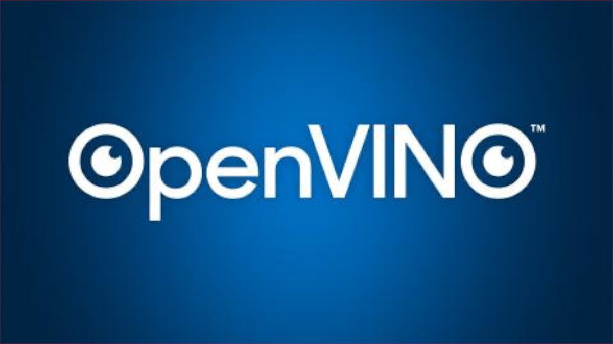
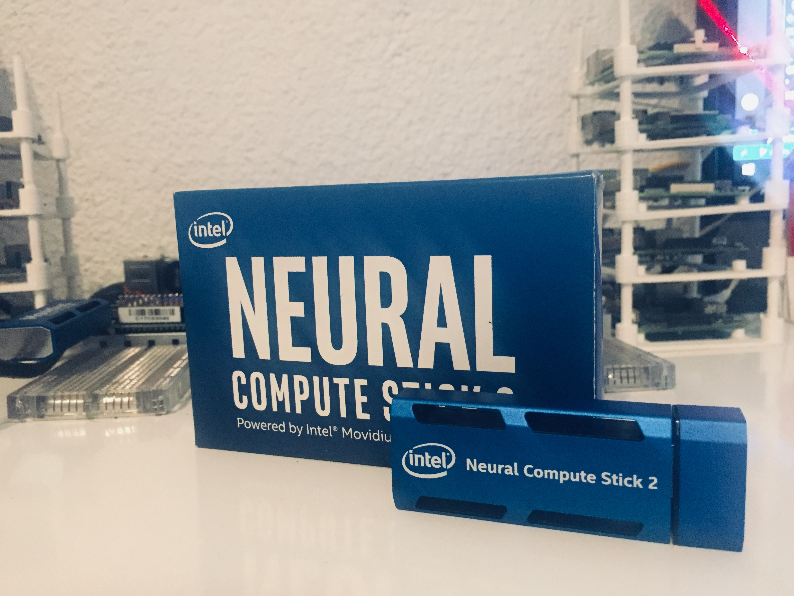

# Peter Moss Acute Myeloid & Lymphoblastic Leukemia AI Research Project
## oneAPI Acute Lymphoblastic Leukemia Classifier

     

&nbsp;

# Table Of Contents

- [Introduction](#introduction)
- [DISCLAIMER](#disclaimer)
- [Acute Lymphoblastic Leukemia](#acute-lymphoblastic-leukemia)
- [ALL-IDB](#all-idb)
  - [ALL_IDB1](#all_idb1)
- [Intel® oneAPI Toolkits (Beta)](#intel-oneapi-toolkits-beta)
- [Intel® Distribution for Python](#intel-distribution-for-python)
- [Intel® Optimization for TensorFlow](#intel-optimization-for-tensorflow)
- [Intel® Distribution of OpenVINO™ Toolkit](#intel-distribution-of-openvino-toolkit)
- [Intel® Movidius™ Neural Compute Stick 2](#intel-movidius-neural-compute-stick-2)
- [Projects](#projects)
  - [CNN](#cnn)
  - [RPI4](#RPI4)
  - [UP2](#UP2)
- [Contributing](#contributing)
  - [Contributors](#contributors)
- [Versioning](#versioning)
- [License](#license)
- [Bugs/Issues](#bugs-issues)

&nbsp;

# Introduction

_Fig 1. Proposed architecture ([Source](https://airccj.org/CSCP/vol7/csit77505.pdf "Source"))_

The **oneAPI Acute Lymphoblastic Leukemia Classifier** is an open-source classifier trained using the [Intel® Distribution for Python*](https://software.intel.com/content/www/us/en/develop/tools/distribution-for-python.html) and [Intel® Optimization for TensorFlow*](https://software.intel.com/content/www/us/en/develop/articles/intel-optimization-for-tensorflow-installation-guide.html) (Tensorflow 2.1), and using [Intel® Distribution of OpenVINO™ Toolkit](https://software.intel.com/content/www/us/en/develop/tools/openvino-toolkit.html) to deploy the model on UP2 & Raspberry Pi for use with Intel Movidius Neural Compute Stick 2.

We will create a network based on the proposed architecture in the [Acute Leukemia Classification Using Convolution Neural Network In Clinical Decision Support System](https://airccj.org/CSCP/vol7/csit77505.pdf "Acute Leukemia Classification Using Convolution Neural Network In Clinical Decision Support System") paper, and will use the [ALL-IDB1](https://homes.di.unimi.it/scotti/all/#datasets) dataset from the [Acute Lymphoblastic Leukemia Image Database for Image Processing](https://homes.di.unimi.it/scotti/all) dataset by [Fabio Scotti](https://homes.di.unimi.it/scotti/).

**This project is compatible with the Acute Lymphoblastic Detection System feature of [HIAS](https://github.com/LeukemiaAiResearch/HIAS "HIAS").**

&nbsp;

# DISCLAIMER

These projects should be used for research purposes only. The purpose of the projects is to show the potential of Artificial Intelligence for medical support systems such as diagnosis systems.

Although the classifiers are accurate and show good results both on paper and in real world testing, they are not meant to be an alternative to professional medical diagnosis.

Developers that have contributed to this repository have experience in using Artificial Intelligence for detecting certain types of cancer. They are not doctors, medical or cancer experts.

Please use this system responsibly.

&nbsp;

# Acute Lymphoblastic Leukemia
Acute Lymphoblastic Leukemia (ALL), also known as Acute Lymphocytic Leukemia, is a cancer that affects the Lymphoid blood cell lineage. Unlike AML, ALL only affects the white blood cells, namely, Lymphocytes. Lymphocytes include B Cells, T Cells and NK (Natural Killer) cells. ALL is caused by Lymphoid Blasts, or Lymphoblasts, developing into immature Lymphocytes, and an abnormal amount of these immature Lymphocytes are produced. Lymphocytes are white blood cells and play a very important role in the immune system helping to fight off diseases.

Acute Lymphoblastic Leukemia is most commonly found in children, and is the most common form of child cancer, with around 3000 cases a year in the US alone. Like Acute Myeloid Leukemia, although common, it is still quite rare. In both children and adults, early detection is critical. Treatment must start immediately due to the aggressiveness of the cancer. [More info](https://www.leukemiaresearchassociation.ai/leukemia).

&nbsp;

# ALL-IDB
You need to be granted access to use the Acute Lymphoblastic Leukemia Image Database for Image Processing dataset. You can find the application form and information about getting access to the dataset on [this page](https://homes.di.unimi.it/scotti/all/#download) as well as information on how to contribute back to the project [here](https://homes.di.unimi.it/scotti/all/results.php). If you are not able to obtain a copy of the dataset please feel free to try this tutorial on your own dataset, we would be very happy to find additional AML & ALL datasets.

## ALL_IDB1
In this project, [ALL-IDB1](https://homes.di.unimi.it/scotti/all/#datasets) is used, one of the datsets from the Acute Lymphoblastic Leukemia Image Database for Image Processing dataset. We will use data augmentation to increase the amount of training and testing data we have.

"The ALL_IDB1 version 1.0 can be used both for testing segmentation capability of algorithms, as well as the classification systems and image preprocessing methods. This dataset is composed of 108 images collected during September, 2005. It contains about 39000 blood elements, where the lymphocytes has been labeled by expert oncologists. The images are taken with different magnifications of the microscope ranging from 300 to 500."

&nbsp;

# Intel® oneAPI Toolkits (Beta)

[Intel® oneAPI Toolkits](https://software.intel.com/content/www/us/en/develop/tools/oneapi.html) are a collection of toolkits that provide the tools to optimize training and running inference on Artificial Intelligence models, maximizing the use of Intel architecture, including CPU, GPU, VPU and FPGA.

&nbsp;

# Intel® Distribution for Python

[Intel® Distribution for Python](https://software.intel.com/content/www/us/en/develop/tools/distribution-for-python.html) enhances standard Python and helps to speed up popular AI packages such as Numpy, SciPy and Scikit-Learn.

&nbsp;

# Intel® Optimization for TensorFlow
[Intel® Optimization for TensorFlow](https://software.intel.com/content/www/us/en/develop/articles/intel-optimization-for-tensorflow-installation-guide.html) optimizes the popular Tensorflow framework using Intel® Math Kernel Library for Deep Neural Networks (Intel® MKL-DNN). Intel® MKL-DNN is an open-source library for enhancing performance by accelerating deep learning libraries such as Tensorflow on Intel architecture.

&nbsp;

# Intel® Distribution of OpenVINO™ Toolkit

[Intel® Distribution of OpenVINO™ Toolkit](https://software.intel.com/content/www/us/en/develop/tools/openvino-toolkit.html) is based on Convolutional Neural Networks and optimizes models used on Intel CPUs/GPUs, VPUs, FPGA etc. Models are converted to [Intermediate Representations (IR)](https://docs.openvinotoolkit.org/latest/openvino_docs_MO_DG_IR_and_opsets.html) which allow them to be used with the [Inference Engine](https://docs.openvinotoolkit.org/2020.2/_docs_IE_DG_Deep_Learning_Inference_Engine_DevGuide.html).

&nbsp;

#### Intel® Movidius™ Neural Compute Stick 2

The Intel® Movidius™ Neural Compute Stick 2 is a USB plug & play AI device for deep learning inference at the edge. Combined with the Intel® OpenVINO™ Toolkit, developers can develop, fine-tune, and deploy convolutional neural networks (CNNs) on low-power applications that require real-time inference.

&nbsp;

#  Projects
There are three projects included in this repository: [CNN](CNN), [RPI4](RPI4) & [UP2](UP2).

## CNN
[CNN](CNN) is the main project, this is the project that you will use to train your Acute Lymphoblastic Leukemia classifier, freeze the model and convert the model to an Intermediate Representation so that it can be used with OpenVINO.

## RPI4
[RPI4](RPI4) is a project that allows you to run your model on a Raspberry Pi 4 using OpenVINO. The project includes IoT connectivity using the HIAS iotJumpWay broker meaning it can be used with any of the HIAS detection systems.

## UP2
[UP2](UP2) is a project that allows you to run your model on a UP2 using OpenVINO. The project includes IoT connectivity using the HIAS iotJumpWay broker meaning it can be used with any of the HIAS detection systems.

&nbsp;

# Contributing
The Peter Moss Acute Myeloid & Lymphoblastic Leukemia AI Research project encourages and welcomes code contributions, bug fixes and enhancements from the Github.

Please read the [CONTRIBUTING](CONTRIBUTING.md "CONTRIBUTING") document for a full guide to forking our repositories and submitting your pull requests. You will also find information about our code of conduct on this page.

## Contributors
- [Adam Milton-Barker](https://www.leukemiaresearchassociation.ai/team/adam-milton-barker "Adam Milton-Barker") - [Asociacion De Investigacion En Inteligencia Artificial Para La Leucemia Peter Moss](https://www.leukemiaresearchassociation.ai "Asociacion De Investigacion En Inteligencia Artificial Para La Leucemia Peter Moss") President/Lead Developer, Sabadell, Spain

&nbsp;

# Versioning
We use SemVer for versioning.

&nbsp;

# License
This project is licensed under the **MIT License** - see the [LICENSE](LICENSE.md "LICENSE") file for details.

&nbsp;

# Bugs/Issues
We use the [repo issues](issues "repo issues") to track bugs and general requests related to using this project. See [CONTRIBUTING](CONTRIBUTING.md "CONTRIBUTING") for more info on how to submit bugs, feature requests and proposals.